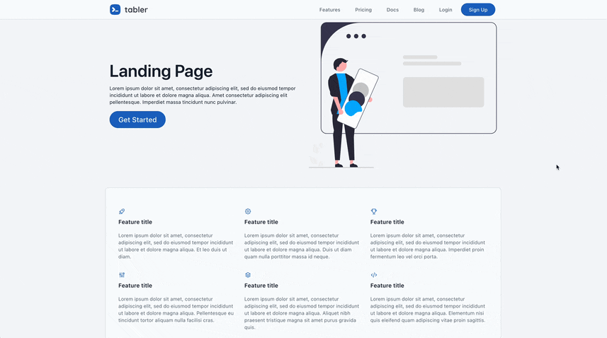

# Rails Tabler Starter

**Skip the first 40 hours of setup. Build your product instead.**

`rails-tabler-starter` is a production-ready boilerplate for developers who want a high-quality UI without the frontend fatigue. It uses a modern **Rails 8** stack (Solid Queue, Solid Cache) and **Tabler (Bootstrap 5)** for a clean, professional dashboard out of the box.

<div align="center">


**[Explore the Demo](https://rails-tabler.tarunvelli.site)**

</div>

## The Goal

1. **Pure Rails:** No proprietary DSLs or "magic". If you know Rails, you know this starter.
2. **Readability > Cleverness:** Standard patterns over complex abstractions.
3. **Batteries Included:** Authentication, Multi-tenancy, and UI components are pre-configured.

## Why this starter?

* **Zero-Config UI:** Tabler components integrated with Hotwire. Dark mode, responsive layouts, and dashboards work immediately.
* **Built-in Multi-Tenancy:** "Spaces" support included. Switch between single-user and B2B SaaS modes via config.
* **Simplified Infrastructure:** Built for Rails 8. Uses `solid_queue` and `solid_cache`—no Redis required for small-to-medium deployments.
* **Secure:** Pre-loaded with Pundit (AuthZ), Devise (AuthN), and Brakeman security auditing.

## The Stack

* **Core:** Rails 8.0+, Ruby 3.3+, SQLite (Production-optimized).
* **Auth:** Devise + OmniAuth (Google/GitHub).
* **UI:** Tabler (Bootstrap 5) + Hotwire/Turbo.
* **Background Jobs:** Solid Queue / Active Job.
* **Deployment:** Pre-configured for **Kamal**, Fly.io, or Heroku.

## Space Management & Architecture

The app uses a **Space-based** architecture for teams or organizations.

* **Standard Roles:** Admin and Member roles per space.
* **Permissions:** Built-in support for custom roles and granular access controls via Pundit.

## Theming Engine

Overhaul the UI via the `AppSettings` singleton. No CSS hunting required. All settings are database-backed and can be modified at runtime.

### Visual Configuration

| Category | Setting | Options |
| --- | --- | --- |
| **Layout** | `interface_layout` | `VERTICAL`, `VERTICAL-TRANSPARENT`, `OVERLAP`, `CONDENSED`, `HORIZONTAL` |
| **Mode** | `color_mode` | `LIGHT`, `DARK` |
| **Primary Color** | `color_scheme` | `BLUE`, `AZURE`, `INDIGO`, `PURPLE`, `PINK`, `RED`, `ORANGE`, `YELLOW`, `LIME`, `GREEN`, `TEAL`, `CYAN` |
| **Theme** | `theme_base` | `NEUTRAL`, `SLATE`, `ZINC`, `GRAY`, `STONE`, `PINK` |
| **Typography** | `font_family` | `SANS-SERIF`, `SERIF`, `MONOSPACE`, `COMIC` |
| **Shapes** | `corner_radius` | `0` to `2` |

### Logic Configuration

| Setting | Default | Description |
| --- | --- | --- |
| `multi_tenant_mode` | `true` | Toggle SaaS-style "Spaces" vs. a single-user app. |
| `show_landing_page` | `true` | Toggle the public marketing page. |

---

## ⚡ Quick Start

```bash
# Clone and setup
git clone https://github.com/tarunvelli/rails-tabler-starter.git my_app
cd my_app
bin/setup

# Start server
bin/dev

```

**Promote User to Admin:**

```ruby
User.first.update(admin: true)

```

## Contributing

1. Fork it.
2. Create your feature branch (`git checkout -b feature/name`).
3. Commit your changes (`git commit -m 'Add feature'`).
4. Push to the branch (`git push origin feature/name`).
5. Open a Pull Request.
