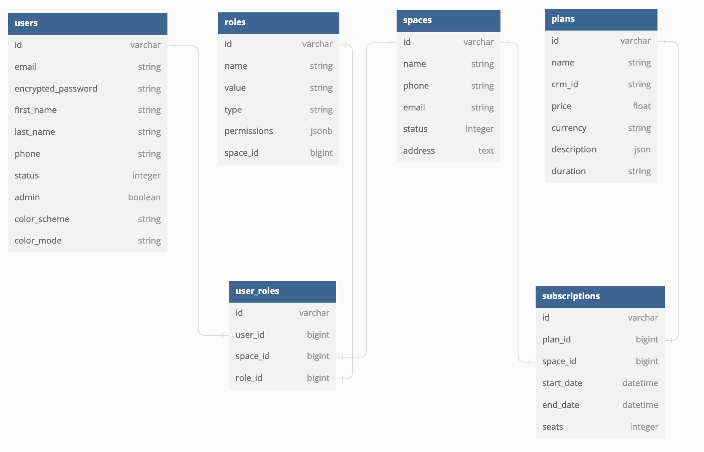

<div align="center">
  <br>
  <h1>Rails Tabler Starter</h1>
  <strong>Rails starter boilerplate that you can use to build and prototype quickly. Get from idea to implementation in hours.</strong>
  <br>
  <br>

  
</div>

[Click here](https://rails-tabler.fly.dev) to view demo application. Check out the [Demo setup page](https://rails-tabler.fly.dev/setup/edit) to toggle application settings.

## Goals

This starter is aimed at Rails developers familiar with the framework, aiming to facilitate seamless development with the following principles:

* No DSL: Avoid unnecessary Domain Specific Language (DSL) complexity.
* Simplicity over Efficiency: Prioritize simplicity in implementation over excessive optimization.
* Avoid Complex Frontend Functionality: Keep frontend functionality straightforward and manageable.

## Overview

* Pre-equipped with essential models such as

    * Users
    * Roles
    * Plans
    * Subscriptions

<div align="center">
  <strong>ERD</strong>

  
</div>

* User authentication & authorization

    * Authentication via [Devise](https://github.com/heartcombo/devise)
    * [OmniAuth](https://github.com/heartcombo/devise/wiki/OmniAuth%3A-Overview) integration to extend authentication using third-party providers
    * Authorization through [Pundit](https://github.com/varvet/pundit)

* Background worker & scheduler

    * Utilizes [sidekiq](https://github.com/mperham/sidekiq/) and [sidekiq-scheduler](https://github.com/sidekiq-scheduler/sidekiq-scheduler)

* Role management

    * Standard roles available across spaces
    * Custom role creation per space
    * Supports fine grained permissions per role

* Multiple user namespaces support

    * Utilizes the `Space` model to represent user namespaces (e.g., teams, organizations).
    * Example use case for turning on multi-space mode is a saas application
    * Example use case for turning off multi-space mode is an internal org tool

* Pre built UI layouts

    * High quality UI elements and layouts from [Tabler](https://tabler.io/)

* Development focussed

    * [Annotate](https://github.com/ctran/annotate_models) - Annotate Rails classes with schema and routes info
    * [Brakeman](https://github.com/presidentbeef/brakeman) - A static analysis security vulnerability scanner
    * [Byebug](https://github.com/deivid-rodriguez/byebug) - Simple debugger
    * [Dotenv](https://github.com/bkeepers/dotenv) - Load environment variables from `.env`

## Setup

To set up the project, ensure you have PostgreSQL and Redis installed locally. Use the following commands to install them:

```
brew install postgresql@12 redis
```

Clone the repo

```
git clone https://github.com/tarunvelli/rails-tabler-starter.git
```

Install the required dependencies using asdf or setup the dependencies `.tool-versions` in other preferred method:
```
asdf install
```

Set up and run the development server:
```
bin/setup
bin/dev
```

To grant administrative privileges to a user and access admin features, run the following in the Rails console:
```
bundle exec rails c
> User.first.update(admin: true)
```

## AppSettings

Toggle app settings at `/setup/edit`

* `AppSettings.interface_layout`
    * Layout of app
    * values ["VERTICAL", "VERTICAL-TRANSPARENT", "HORIZONTAL", "OVERLAP", "CONDENSED"]

* `AppSettings.interface_mode`
    * Light/Dark mode of app
    * "SYSTEM" picks the mode from system preferences
    * Values ["LIGHT", "DARK", "SYSTEM"]

* `AppSettings.interface_theme`
    * Color theme of app
    * Values ["DEFAULT", "COOL"]

* `AppSettings.login_layout` one of
    * Layout of login screens
    * Values ["DEFAULT", "ILLUSTRATION", "COVER"]

* `AppSettings.multi_tenant_mode`
    * When true allows users to sign up and create spaces
    * When false allows only admin to invite users and create spaces
    * Values [true, false]

* `AppSettings.show_landing_page`
    * When true root path renders landing page
    * When false root path redirects to sign in page
    * Values [true, false]

## Deployment

Choose your preferred deployment platform:

* Deploy on [Fly.io](https://fly.io/docs/rails/getting-started/)
* Deploy on [Heroku](https://devcenter.heroku.com/articles/getting-started-with-rails7)

## Contribution

Contributions to enhance this starter are highly encouraged and welcomed! Feel free to submit pull requests and improve the project collaboratively.